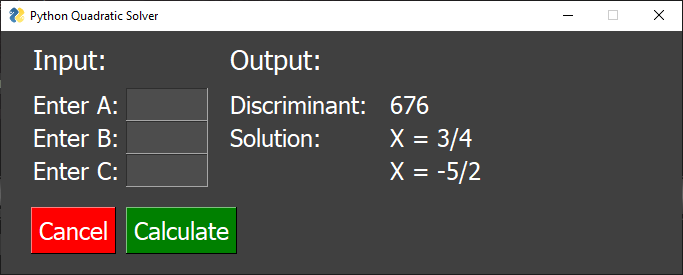

# python-quadratic-solver
This solves equations using the quadratic formula. It's probably super unoptimized, but I don't care since it does its job.

Requires PySimpleGUI.

### How to use:

When you run it, it will ask for A, B, and C.
Input A, B, and C from your standard form (Ax^2 + Bx + C = 0) quadratic equation and push the calculate button.

### Things I need to do:

- [x] Start a GUI.
- [ ] Finish the GUI.
- [ ] Make answers easier to read. Don't format like (-1 ± i√3) / (2)
